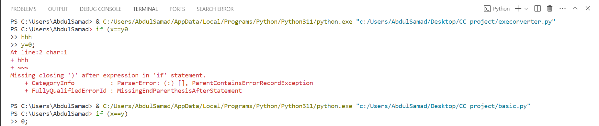

# 🛠️ Auxil Compiler & Number Conversion Simulator

<div align="center">


A double-module educational repository developed for the **Compiler Construction Lab** at Bahria University. It features a complete custom scripting language interpreter (**Auxil Language**) built from scratch, and a graphical **Compiler Phase Simulator** targeting numerical base conversions (Binary, Octal, Decimal, Hexadecimal) to showcase lexical, syntax, semantic, and intermediate code generation phases in a structured GUI format.

</div>

---

## 📸 Project Screenshots

<table>
  <tr>
    <td align="center"><br/><b>💻 Auxil Compiler — Interactive Shell & Syntax Error Highlighting with Arrows</b></td>
  </tr>
</table>

---

## 🚀 Module 1: The Auxil Language & Interpreter

Auxil is a custom programming language designed from the ground up to demonstrate compiler engineering principles:

### ⚡ Language Features
- **Lexical Analysis (Lexer)**: Scans input code and constructs token objects for identifiers, numbers, strings, keywords, operators, and formatting.
- **Recursive Descent Parser**: Converts tokens into an Abstract Syntax Tree (AST) using top-down parsing.
- **Error Visualization**: Precise token tracking displays exact syntax/runtime errors highlighted with `^` arrows indicating line, column, and span (e.g., `strings_with_arrows.py`).
- **Interpreter**: Evaluates statements dynamically with support for basic arithmetic, relational logic, loops, conditionals (`IF`/`ELIF`/`ELSE`), variable bindings (`VAR`), and custom functions.

### 📝 Auxil Code Example
```basic
# Variable allocation and simple conditional logic
VAR x = 10
VAR y = 20

IF x < y THEN
    x + y
ELSE
    y - x
END
```

---

## 🌐 Module 2: Number Conversion Simulator (`execonverter.py`)

A graphical desktop application that implements a specialized compiler pipeline specifically designed to convert numbers between **Binary**, **Octal**, **Decimal**, and **Hexadecimal** systems:

### ⚙️ Compiler Pipeline Execution
1. **Lexical Analyzer**: Tokenizes the input string and strips whitespace.
2. **Syntax Analyzer**: Validates whether the digits/symbols match the alphabet rules of the chosen input base.
3. **Semantic Analyzer**: Checks for type compatibility and handles exceptions (e.g., preventing conversions where input and output bases are the same).
4. **Intermediate Code Generator (ICG)**: Translates the valid tokens into target base representations.

---

## 📂 Project Structure

```
Binary-to-decimal-Decimal-to-Binary-Converter/
│
├── 🐚 shell.py                  — Interactive terminal shell for the Auxil Interpreter
├── 🐍 basic.py                  — Core Auxil language implementation (Lexer, Parser, AST, Interpreter)
├── 🏹 strings_with_arrows.py    — Position tracker and arrow error formatter
│
├── 🖥️  execonverter.py           — Tkinter-based Compiler Phase Simulator for base conversions
│
├── 📁 screenshots/
│   ├── bu_logo.jpg              — Bahria University Logo
│   └── terminal_execution.png   — CLI trace showcasing Lexer syntax parsing validation
│
├── 📄 README.md                 — Comprehensive project guide
└── 📦 CC project.zip            — Solution archive (reports, slides, and code)
```

---

## 🚀 Getting Started

### Prerequisites

- **Python 3.x**
- **Tkinter** (usually included with standard Python installations)
- **Inflect package** (`pip install inflect`)

### running the Auxil REPL (Interactive Shell)

1. Clone this repository:
   ```bash
   git clone https://github.com/AnasQ2003/Binary-to-decimal-Decimal-to-Binary-Converter.git
   cd Binary-to-decimal-Decimal-to-Binary-Converter
   ```
2. Launch the interactive shell:
   ```bash
   python shell.py
   ```
3. Type custom Auxil commands:
   ```basic
   basic > VAR a = 5
   basic > a * 2
   10
   ```

### running the Compiler Simulator

1. Install dependencies:
   ```bash
   pip install inflect
   ```
2. Run the Tkinter GUI:
   ```bash
   python execonverter.py
   ```

---

## 🧠 Compiler Construction Concepts Applied

| Concept | Implementation in Project |
|---|---|
| **Lexical Analysis (Lexer)** | Character scanner building token objects using regular expressions and constants. |
| **Syntax Analysis (Parser)** | Parser building an Abstract Syntax Tree (AST) of mathematical expressions. |
| **Error Highlighting** | `strings_with_arrows` maps coordinates to provide modern IDE-like console warnings. |
| **Semantic Analysis** | Type-checking inputs against their target constraints. |
| **Intermediate Representation** | Execution values translated down to numeric arrays/bases. |
| **Runtime Environment** | Value lookup tables and scoping variables during interpreter traversal. |

---

## 📚 Course Context

| Detail | Info |
|---|---|
| **University** | Bahria University, Karachi Campus |
| **Department** | Department of Computer Science |
| **Course** | Compiler Construction Lab (CSL-323) |
| **Semester** | 5th Semester |
| **Class** | BSCS 5A |
| **Teacher** | Ma'am Saba Imtiaz |
| **Group Members** | Abdul Samad, Anas Ahmed Qureshi, M. Ahmed Usmani |

---

## 👨‍💻 Author

**Anas Qayyum**
- GitHub: [@AnasQ2003](https://github.com/AnasQ2003)
